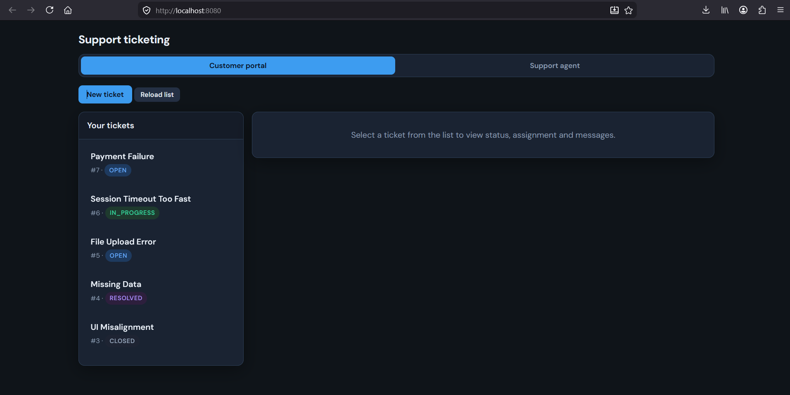
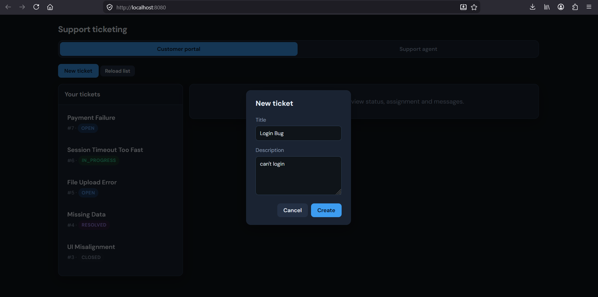
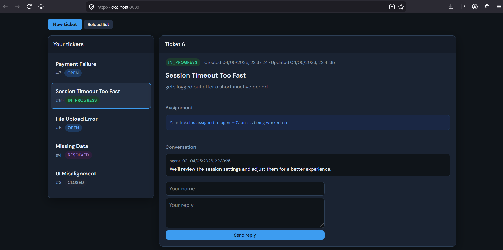
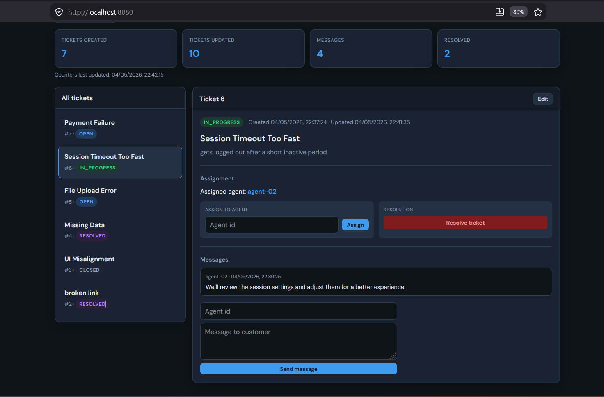
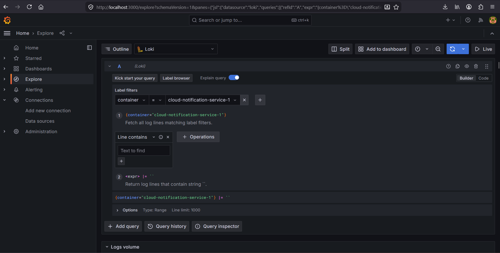
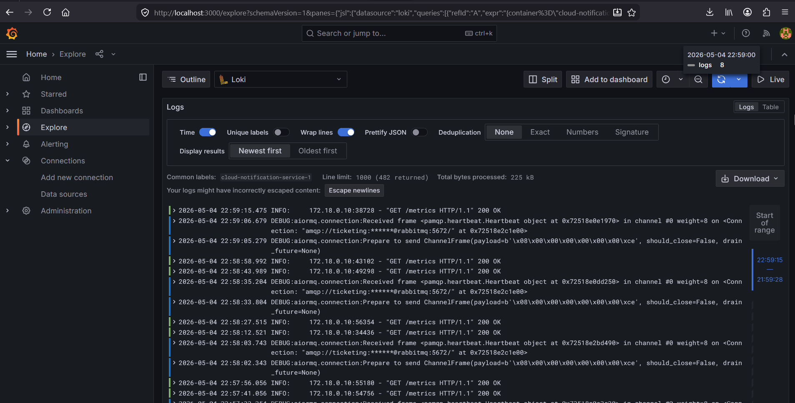
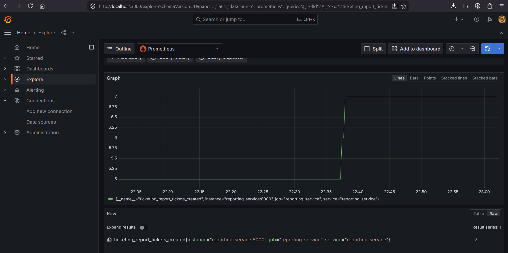
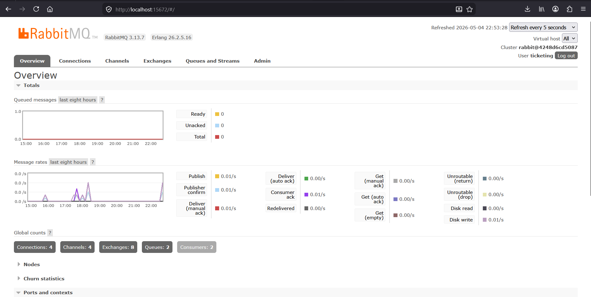
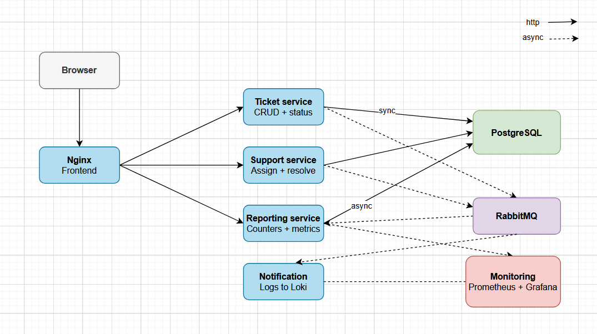

# Customer Support Ticketing System

 A customer support ticketing system built with Python microservices. Customers can submit tickets and track their status. Support agents can assign, reply and resolve tickets. The system uses RabbitMQ for async communication between services and includes a monitoring stack with Prometheus, Grafana and Loki.

---

## Screenshots

### Web UI

The main landing page showing the overall layout and stats summary.


Ticket creation form where customers submit a new support request.


Customer portal tab - customers can view their tickets and reply to messages.


Support agent tab - agents can assign, message and resolve tickets.


### Monitoring (Grafana + Loki + Prometheus)

Loki logs in Grafana showing notification events 



Prometheus metrics showing ticket counters scraped from the services.


### Message Broker (RabbitMQ)


## Project structure


| Folder                           | What it does                                                     |
| -------------------------------- | ---------------------------------------------------------------- |
| `services/ticket-service/`       | Creates and tracks tickets, stores in Postgres, publishes events |
| `services/support-service/`      | Handles assignments, messages and resolution                     |
| `services/reporting-service/`    | Counts events from RabbitMQ, exposes summary endpoint            |
| `services/notification-service/` | Listens to events and logs a notification for each one           |
| `frontend/`                      | HTML/CSS/JS web UI served by nginx with two tabs                 |
| `k8s/`                           | Kubernetes manifests for deploying the full stack                |
| `monitoring/`                    | Prometheus, Grafana and Loki configuration                       |


---

## Service responsibilities and communication


| Event              | Published by    | Consumed by                             |
| ------------------ | --------------- | --------------------------------------- |
| `ticket.created`   | ticket-service  | reporting-service, notification-service |
| `ticket.updated`   | ticket-service  | reporting-service, notification-service |
| `support.message`  | support-service | reporting-service, notification-service |
| `support.resolved` | support-service | reporting-service, notification-service |


### Architecture



### Synchronous (HTTP)

- Support-service → ticket-service: validate ticket exists and update ticket status when resolving.

### Asynchronous (RabbitMQ events)

- ticket-service publishes: `ticket.created`, `ticket.updated`
- support-service publishes: `support.message`, `support.resolved`
- reporting-service consumes all events and updates counters
- notification-service consumes all events and writes notification logs

---

## Local development (Docker Compose)

### Prerequisites

You need Docker and Docker Compose installed on a Linux machine (Ubuntu recommended). Run `docker compose version` to verify.

### Environments (.env files)

The same `docker-compose.yml` runs in different modes depending on the chosen env file:

- `**.env.development**`: debug logs, auto-reload
- `**.env.testing**`: CI-like (no reload, INFO logs)
- `**.env.production**`: production-style (no reload, more workers, quieter logs)

Start one stack:

```bash
docker compose --env-file .env.development up -d --build
```

Stop it:

```bash
docker compose --env-file .env.development down
```

### URLs (default ports)

- Web UI: `http://localhost:8080`
- Ticket API (Swagger): `http://localhost:8001/docs`
- Support API (Swagger): `http://localhost:8002/docs`
- Reporting API (Swagger): `http://localhost:8003/docs`
- Notification API: `http://localhost:8004/health`
- RabbitMQ management: `http://localhost:15672` (default user/pass `ticketing` / `ticketing`)
- Prometheus: `http://localhost:9090`
- Grafana: `http://localhost:3000` (default `admin` / `admin`)
- Loki: `http://localhost:3100`

### Quick demo flow

1. Create a ticket:
  - `POST http://localhost:8001/tickets`
  - Body: `{"title":"Login bug","description":"Cannot sign in"}`
2. Assign an agent:
  - `POST http://localhost:8002/tickets/1/assign`
  - Body: `{"agent_id":"agent-01"}`
3. Post a support message:
  - `POST http://localhost:8002/tickets/1/messages`
  - Body: `{"agent_id":"agent-01","body":"We are investigating."}`
4. Resolve the ticket:
  - `POST http://localhost:8002/tickets/1/resolve`
5. View reporting counters:
  - `GET http://localhost:8003/reports/summary`

---

## Observability (Compose)

The stack includes Prometheus for metrics, Loki for logs and Grafana to view both. Logs from all containers are collected automatically and sent to Loki. To see notification logs: open Grafana → Explore → select Loki → run the query `{container_name=~".*notification.*"}` or `{log_stream="stdout"} |= "NOTIFY"`

---

## Running all environments at once

For demonstration only (resource heavy), you can run development/testing/production-style stacks in parallel using different ports:

```bash
chmod +x scripts/run-all-envs.sh
./scripts/run-all-envs.sh
```

This uses:

- `.env.parallel.dev`
- `.env.parallel.test`
- `.env.parallel.prod`

---

## Kubernetes deployment (manifests)

### Prerequisites

- `kubectl`
- `minikube` (`minikube start --driver=docker`)
- Docker installed and running

```bash
minikube start --driver=docker
```

### 1) Build images

From repo root, build the four service images (same Dockerfiles used by Compose):

```bash
docker build -f docker/ticket-service/Dockerfile -t ticketing-ticket-service:latest .
docker build -f docker/support-service/Dockerfile -t ticketing-support-service:latest .
docker build -f docker/reporting-service/Dockerfile -t ticketing-reporting-service:latest .
docker build -f docker/notification-service/Dockerfile -t ticketing-notification-service:latest .
```

### 2) Image availability

```bash
minikube image load ticketing-ticket-service:latest
minikube image load ticketing-support-service:latest
minikube image load ticketing-reporting-service:latest
minikube image load ticketing-notification-service:latest
```

### 3) Create secrets

`k8s/secret.example.yaml` is a template. Copy it and edit values:

```bash
cp k8s/secret.example.yaml k8s/secret.yaml
# edit k8s/secret.yaml
```

Keep the password fields consistent with the URLs inside the secret.

### 4) Apply manifests

Apply in this order:

```bash
kubectl apply -f k8s/namespace.yaml
kubectl apply -f k8s/configmap.yaml
kubectl apply -f k8s/secret.yaml
kubectl apply -f k8s/postgres.yaml
kubectl apply -f k8s/rabbitmq.yaml
kubectl apply -f k8s/apps.yaml
```

### 5) Access services

Use port-forwarding for local access. Use a different port if Docker Compose is already running on the default ports:

```bash
kubectl -n ticketing port-forward svc/ticket-service 9001:8000
```

Then open `http://localhost:9001/docs`.

### Notes

- The Kubernetes manifests focus on the core platform (Postgres, RabbitMQ, services).
- The full monitoring stack is included in Compose; Kubernetes monitoring can be added separately (e.g., Helm charts / Prometheus Operator) if needed.

---

## Cleanup (Kubernetes)

Remove the namespace and everything inside it:

```bash
minikube stop
kubectl delete namespace ticketing
```

---

